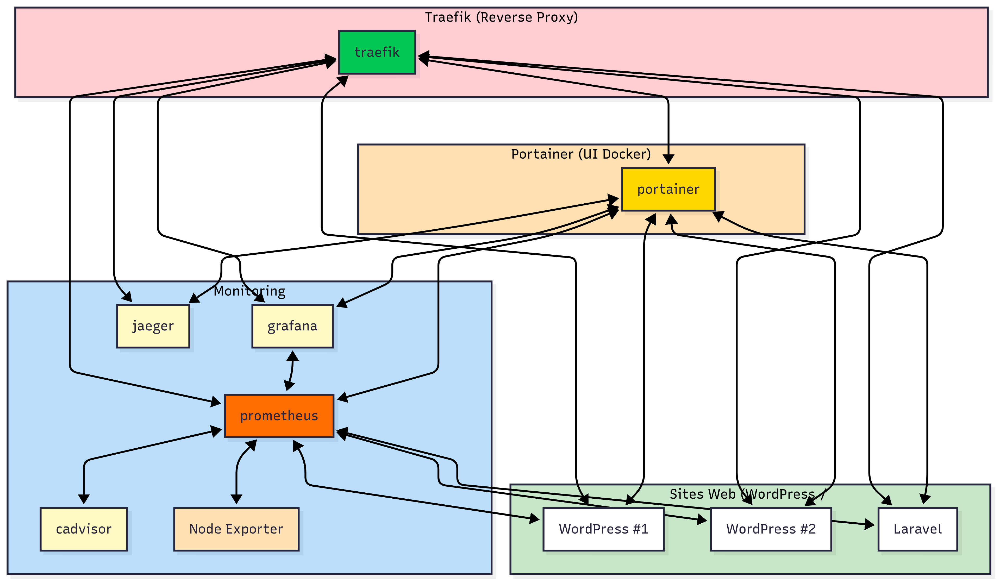

# 🛠️ WPOpsX

[](https://www.docker.com/)
[](./LICENSE)
[](../../)

## Plateforme de Déploiement Automatisé WordPress & Laravel avec Traefik

**WPOpsX** est une solution clé en main pour déployer, sécuriser, superviser et maintenir des sites **WordPress** (et **Laravel**) à l'aide de **Docker** et **Traefik**.
Elle permet de gérer de façon centralisée plusieurs sites web avec :

* Routage automatique HTTP/HTTPS
* Certificats SSL Let's Encrypt
* Monitoring avancé (Prometheus, Grafana, etc.)
* Backups et mises à jour automatisées
* Interface de gestion sécurisée


## 🚀 Fonctionnalités principales

* ✅ **Déploiement en une ligne** de sites WordPress ou Laravel via script
* 🔐 **Gestion automatique des certificats SSL** (Let's Encrypt, Wildcard)
* 🧱 **Infrastructure sécurisée** : permissions, en-têtes HTTP, isolation réseau
* ♻️ **Sauvegardes automatisées** : fichiers + base de données, rotation sur 7 jours
* 🔄 **Mises à jour automatiques** : WordPress, plugins, thèmes, traductions
* 📈 **Monitoring intégré** :
  * Prometheus, Grafana, Node Exporter, cAdvisor, Jaeger
* 🔧 **Traefik prêt à l'emploi** : reverse proxy avec dashboard sécurisé
* 🔧 **Scripts d'administration** pour automatiser la maintenance
* 🖥️ **Portainer intégré** : interface web moderne pour gérer vos conteneurs, stacks, volumes et réseaux Docker en toute sécurité


## 🧱 Architecture du projet

```
WPOpsX/
├── traefik/                # Configuration et gestion centralisée des domaines
│   ├── traefik.yml         # Configuration statique
│   ├── dynamic/            # Règles dynamiques (SSL, headers, auth)
│   └── update-domains.sh   # Mise à jour automatique des domaines
│
├── wordpress/              # Templates de déploiement WordPress/Laravel
│   ├── template/           
│   │   ├── docker-compose.yml
│   │   ├── .env
│   │   └── deploy.sh       # Script de déploiement automatique
│   └── README.md           # Documentation détaillée
│
├── portainer/              # UI de gestion Docker (modulaire, sécurisée)
│   └── docker-compose.yml  # Déploiement Portainer
│
└── monitoring/             # Stack d'observabilité complète
    ├── prometheus/
    ├── grafana/
    └── exporters/
```



*Schéma global : reverse proxy, monitoring, UI Docker, et sites WordPress/Laravel interconnectés via Traefik et réseaux Docker.*


## ⚡ Guide d'utilisation rapide

### 1. ✅ Prérequis

* Docker & Docker Compose
* Accès root ou sudo
* DNS configuré pour les domaines à utiliser


### 2. 🚀 Déployer un site WordPress

```bash
cd wordpress/template
./deploy.sh monsite monsite.exemple.com
```

📘 Voir `wordpress/template/README.md` pour les options avancées (mots de passe, volumes, environnement Laravel, etc.)


### 3. 🔄 Mettre à jour les domaines dans Traefik

```bash
cd traefik
./update-domains.sh
```

> 🔐 Les certificats SSL seront automatiquement générés et attachés.


### 4. 📊 Accéder aux outils de monitoring

* **Prometheus** : [https://prometheus.votre-domaine.com](https://prometheus.votre-domaine.com)
* **Grafana** : [https://grafana.votre-domaine.com](https://grafana.votre-domaine.com)  (📂 Identifiants par défaut : `admin` / `admin`)
* **cAdvisor** : [https://cadvisor.votre-domaine.com](https://cadvisor.votre-domaine.com)
* **Traefik Dashboard** : [https://traefik.votre-domaine.com](https://traefik.votre-domaine.com) *(auth sécurisé)*


### 5. 🖥️ Déployer Portainer (UI Docker)

```bash
cd portainer
docker-compose up -d
```

- Accédez à l'interface : https://portainer.${DOMAIN_NAME}
- Sécurisé automatiquement par Traefik (SSL, accès via sous-domaine)
- Permet la gestion graphique de tous vos conteneurs, stacks, volumes, réseaux, utilisateurs, etc.


### 6. ⚙️ Variables d'environnement & configuration

Chaque module du projet (monitoring, portainer, traefik, wordpress) dispose d'un fichier `.env.example` à copier en `.env` et à personnaliser selon vos besoins.

- `DOMAIN_NAME` : domaine principal utilisé pour le routage Traefik et l'accès aux interfaces web
- `GRAFANA_ADMIN_USER` / `GRAFANA_ADMIN_PASSWORD` : identifiants Grafana (monitoring)
- Autres variables spécifiques selon les modules (voir les README de chaque dossier)

```bash
cp <module>/.env.example <module>/.env
# puis éditez le fichier .env selon vos besoins
```

> 🔑 **Pensez à bien configurer vos accès et mots de passe pour la sécurité de votre infrastructure.**


## 🧩 Fonctionnalités à venir

* Intégration GitHub/GitLab CI/CD
* Interface web de gestion multi-sites
* Backups vers S3 (Amazon, Wasabi, etc.)
* Module Laravel full auto
* Alerting Telegram / Email


## 🤝 Contribuer

Les contributions sont les bienvenues !
Tu peux soumettre une PR, ouvrir une issue ou discuter dans les tickets.


## 📄 Licence

Ce projet est sous licence **MIT** — libre d'usage, de modification et de redistribution, même en usage commercial.


## 👨‍💻 Auteur

**Eurin HASH** – Architecte solutions digitales, passionné de cloud et cybersécurité.
👉 [eurinhash.com](https://eurinhash.com) | [digitaleflex.com](https://digitaleflex.com)


## ❓ FAQ / Foire Aux Questions

### Le déploiement échoue, que faire ?
- Vérifiez que Docker et Docker Compose sont bien installés et fonctionnels.
- Vérifiez que les ports 80 et 443 sont libres et accessibles.
- Consultez les logs du script ou des services avec `docker logs <service>`.

### Les certificats SSL ne sont pas générés
- Vérifiez que le port 80 est ouvert et accessible depuis l'extérieur.
- Vérifiez la configuration DNS de vos domaines.
- Consultez les logs Traefik pour d'éventuelles erreurs ACME.

### Impossible d'accéder à l'interface Portainer, Grafana ou Prometheus
- Vérifiez que le DNS pointe bien vers votre serveur.
- Vérifiez que les services sont bien démarrés (`docker-compose ps`).
- Vérifiez la configuration du fichier `.env` (domaine correct).

### Comment changer les mots de passe par défaut ?
- Modifiez les variables dans les fichiers `.env` de chaque module avant le premier lancement.
- Pour Grafana : `GRAFANA_ADMIN_USER` et `GRAFANA_ADMIN_PASSWORD`.
- Pour Portainer : définissez le mot de passe à la première connexion.

### Comment sauvegarder ou restaurer mes données ?
- Toutes les données sont stockées dans des volumes Docker (voir la documentation de chaque module).
- Utilisez les scripts de sauvegarde intégrés ou `docker cp`/`docker volume` pour exporter/importer.

### Comment ajouter un nouveau domaine ou site ?
- Déployez un nouveau site avec le script WordPress/Laravel.
- Exécutez `./update-domains.sh` dans le dossier `traefik` pour mettre à jour la configuration.

