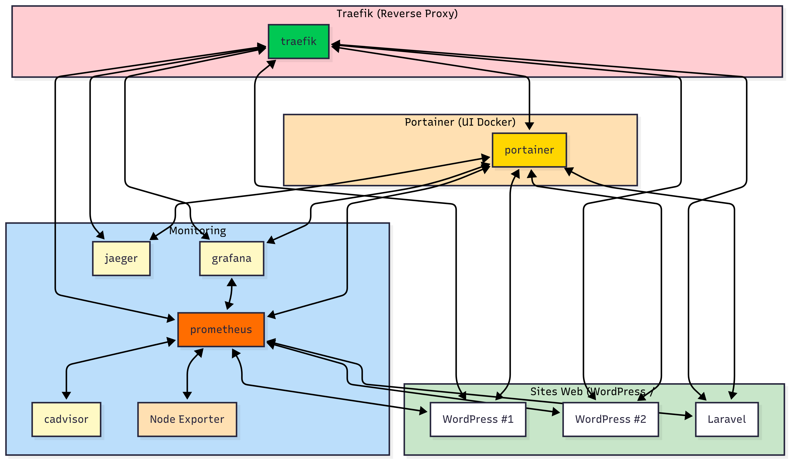

# WPOpsX

[](https://github.com/digitaleflex/WPOpsX/actions/workflows/ci.yml)
[](https://www.docker.com/)
[](./LICENSE)
[](../../)

## Plateforme de déploiement automatisé WordPress avec Traefik

**WPOpsX** déploie, sécurise, supervise et maintient des sites **WordPress** avec **Docker** et **Traefik** :
routage HTTP/HTTPS automatique, certificats Let's Encrypt, monitoring, sauvegardes et mises à jour
automatisées, interface de gestion Docker.

## Fonctionnalités

- **Déploiement en une commande** d'un site WordPress (base, cache, TLS, sauvegardes, cron)
- **Certificats SSL automatiques** (Let's Encrypt, un domaine par site)
- **Infrastructure cloisonnée** : chaque base de données est sur un réseau interne, jamais exposée au proxy
- **Sauvegardes automatiques** (base + fichiers) avec rotation et contrôle d'intégrité
- **Mises à jour automatiques** : WordPress, extensions, thèmes, traductions
- **Monitoring** : Prometheus, Grafana, Jaeger, Node Exporter, cAdvisor
- **Portainer** : gestion graphique des conteneurs, stacks, volumes et réseaux
- **Porte de vérification** (`scripts/verify.sh`) exécutée en local et en CI

## Architecture

```
WPOpsX/
├── scripts/
│   ├── init.sh               # prérequis hôte : réseau proxy, traefik/acme.json, .env des modules
│   └── verify.sh             # porte de vérification (YAML, Bash, Compose, config Traefik)
│
├── traefik/                  # reverse proxy + gestion des certificats
│   ├── traefik.yml           # configuration STATIQUE
│   ├── dynamic/              # configuration DYNAMIQUE (middlewares partagés, rechargée à chaud)
│   ├── acme.json             # certificats + compte ACME — à préserver, jamais régénéré
│   ├── docker-compose.yml
│   └── update-domains.sh     # inventaire/contrôle des domaines déployés
│
├── wordpress/
│   └── template/             # modèle de site (copié par deploy.sh)
│       ├── deploy.sh         # déploiement d'un site
│       ├── docker-compose.yml
│       ├── backup.sh         # sauvegarde base + fichiers (rotation 7 jours)
│       ├── update.sh         # mises à jour WordPress
│       └── .env.example
│
├── portainer/                # interface de gestion Docker (accès authentifié)
└── monitoring/               # Prometheus, Grafana, Jaeger, exporters
```



## Démarrage rapide

### 1. Prérequis

- Docker avec le plugin **`docker compose` v2** (la commande `docker-compose` v1 est en fin de vie
  depuis 2023)
- Accès root ou sudo
- Ports **80** et **443** libres
- Un enregistrement DNS par domaine, pointant vers le serveur

### 2. Initialiser l'hôte

```bash
./scripts/init.sh
```

Crée le réseau Docker externe `proxy`, le fichier **`traefik/acme.json`** (mode 600, stockage des
certificats et du compte ACME) et les `.env` des modules depuis leurs `.env.example`, puis valide toutes
les configurations.

### 3. Démarrer le reverse proxy

```bash
cd traefik
# Personnaliser l'email Let's Encrypt dans traefik.yml (il ne peut pas venir du .env)
docker compose up -d
```

À faire **une seule fois** par infrastructure : tous les sites s'y raccrochent ensuite.

### 4. Déployer un site

```bash
cd wordpress/template
./deploy.sh mon-site mon-site.exemple.com
```

Le script génère les mots de passe, écrit le `.env` (mode 600), démarre la base, le cache et WordPress,
vérifie la réponse HTTPS, puis installe deux tâches cron : sauvegarde quotidienne (02h00) et mises à jour
hebdomadaires (dimanche 03h00).

```bash
./deploy.sh --clean mon-site mon-site.exemple.com   # repartir de zéro (SUPPRIME les données)
./deploy.sh --no-cron mon-site mon-site.exemple.com # sans tâches planifiées
```

### 5. Modules optionnels

```bash
cd portainer  && cp .env.example .env && chmod 600 .env && docker compose up -d
cd monitoring && cp .env.example .env && chmod 600 .env && docker compose up -d
```

Chaque module exige son `.env` (domaine, identifiants) : `docker compose up` **échoue volontairement** si
un mot de passe est absent, plutôt que de déployer une interface d'administration sans protection.

## Sécurité

- Aucun mot de passe par défaut : les `.env` refusent de démarrer sans identifiants explicites.
- Interfaces d'administration (Traefik, Portainer, monitoring) derrière Traefik, en HTTPS et authentifiées.
- Aucun port d'administration publié sur l'hôte : tout passe par le reverse proxy.
- Bases de données sur un réseau Docker interne, hors de portée du proxy.
- `security_opt: no-new-privileges` sur tous les conteneurs applicatifs, `cap_drop: ALL` sur Traefik.
- Secrets jamais écrits en clair dans les scripts ni dans la crontab (lecture depuis `.env`).
- `.env`, `traefik/acme.json` et les journaux sont ignorés par Git.

Voir [SECURITY.md](SECURITY.md) pour la procédure de signalement.

## Maintenance

```bash
# Vérifier l'infrastructure avant tout commit
./scripts/verify.sh              # YAML, Bash, Compose, chargement réel de la config Traefik
./scripts/verify.sh --fast       # sans Docker

# Sauvegarder / mettre à jour un site
cd wordpress/mon-site && ./backup.sh
cd wordpress/mon-site && ./update.sh

# Sauvegarder les certificats (traefik/acme.json : à inclure dans la sauvegarde serveur)
cp traefik/acme.json ~/acme-$(date +%F).json && chmod 600 ~/acme-$(date +%F).json

# Contrôler les domaines et les certificats
cd traefik && ./update-domains.sh
```

## Documentation détaillée

- [`traefik/README.md`](traefik/README.md) — configuration, certificats, pièges vérifiés, migration
- [`wordpress/template/README.md`](wordpress/template/README.md) — déploiement, sauvegarde, restauration
- [`monitoring/README.md`](monitoring/README.md) — supervision
- [`portainer/README.md`](portainer/README.md) — gestion Docker
- [`docs/`](docs/README.md) — guides, FAQ
- [`coming_soon.md`](coming_soon.md) — feuille de route (dont le mode Lite)

## Contribuer

Les contributions sont bienvenues : ouvrir une issue, proposer une PR.
Avant de proposer un changement : `./scripts/verify.sh` doit passer, et le message de commit suivre
[Conventional Commits](https://www.conventionalcommits.org/).

## Licence

MIT — libre d'usage, de modification et de redistribution, y compris commercial.

## Auteur

**Eurin HASH** — [eurinhash.com](https://eurinhash.com) | [digitaleflex.com](https://digitaleflex.com)

## FAQ

### Le déploiement échoue, que faire ?
- `./scripts/verify.sh` signale les erreurs de configuration avant toute chose.
- Vérifier que Docker et le plugin `docker compose` v2 sont installés (`docker compose version`).
- Vérifier que les ports 80 et 443 sont libres.
- Consulter les journaux : `cd wordpress/<site> && docker compose logs`.

### Les certificats SSL ne sont pas générés
- `traefik/acme.json` doit exister et être en mode 600 (`./scripts/init.sh`), sinon Traefik désactive l'ACME.
- Le port 80 doit être joignable depuis Internet (challenge HTTP-01).
- Le DNS du domaine doit pointer vers le serveur.
- `docker logs traefik 2>&1 | grep -i acme`.
- Détail et réparation : [`traefik/README.md`](traefik/README.md#traefikacmejson--le-fichier-à-ne-jamais-perdre).

### Un site répond 502 derrière Traefik
- Le conteneur doit être sur le réseau `proxy` et porter le label `traefik.docker.network=proxy`
  (sinon Traefik peut choisir le mauvais réseau interne).

### Les uploads WordPress échouent
- `wp-content` doit appartenir à `www-data` (uid 33) : le service `wordpress-init` s'en charge au
  démarrage. Relancer avec `docker compose up -d --force-recreate`.

### Comment changer un mot de passe ?
- Base / Redis : éditer le `.env` du site puis `docker compose up -d` (les volumes conservent les données).
- Grafana / Portainer : via leurs interfaces, ou en modifiant leur `.env` avant le premier démarrage.

### Comment sauvegarder ou restaurer ?
- `cd wordpress/<site> && ./backup.sh` (base + fichiers, rotation 7 jours).
- La procédure de restauration est documentée en tête de `backup.sh`.

### Comment ajouter un domaine ?
- `./deploy.sh <site> <nouveau-domaine>` puis mettre à jour le DNS : Traefik découvre le router tout seul
  et émet le certificat. Aucune modification de fichier de configuration n'est nécessaire.
